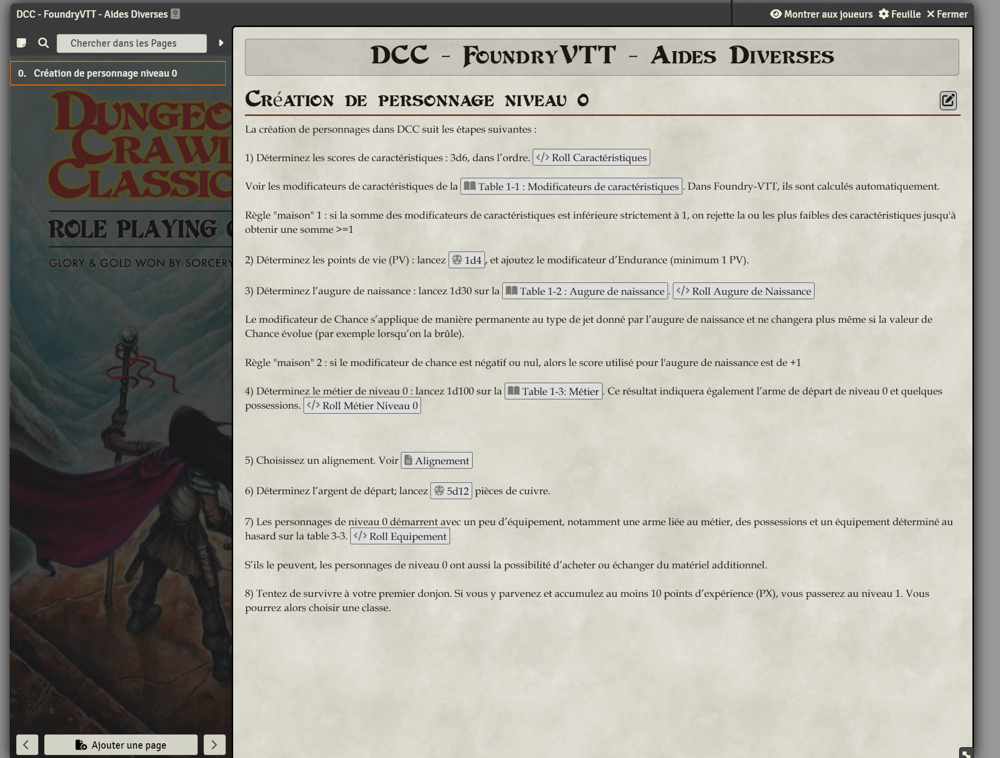
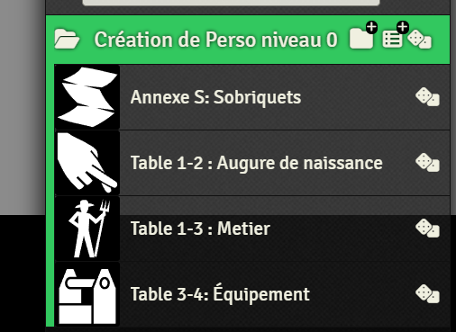

# Page de journal pour la Création de personnage niveau 0

- Copiez le contenu de create_0lvl_character.html dans une page de type Journal.

- Créez les macros et adaptez les identifiants des tables "Roll Table".
    - Roll stats
    - Roll augure de naissance
    - Roll métier niveau 0
    - Roll équipement

- Adapter les identifiants des macros dans le code HTML.

