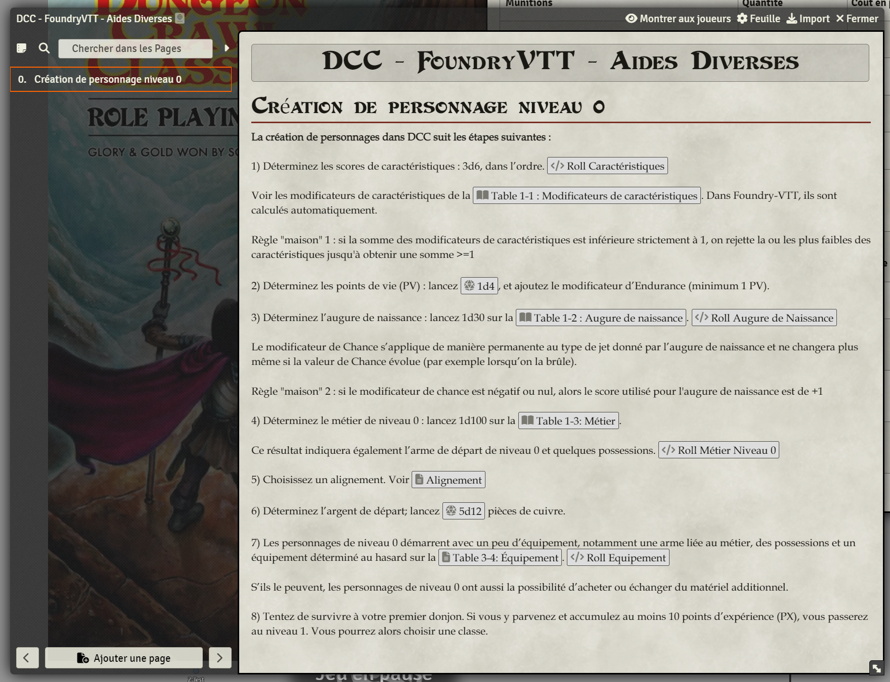

# Page de journal pour la Création de personnage niveau 0

- Copiez le contenu de create_0lvl_character.html dans une page de type Journal.

- Créez les macros et adaptez les identifiants des tables "Roll Table". Ces macros peuvent être créées dans votre propre Compendium ([shared compendium](https://youtu.be/RaRtUkNdoig?si=fskRGR87xM_5feRE)) :
    - Roll stats
    - Roll augure de naissance
    - Roll métier niveau 0
    - Roll équipement

- Adapter les identifiants des macros dans le code HTML. Remplacer les uuid de macro de Compendium.ludorg-shared-compendia.dcc-macros.Macro par les vôtres.

